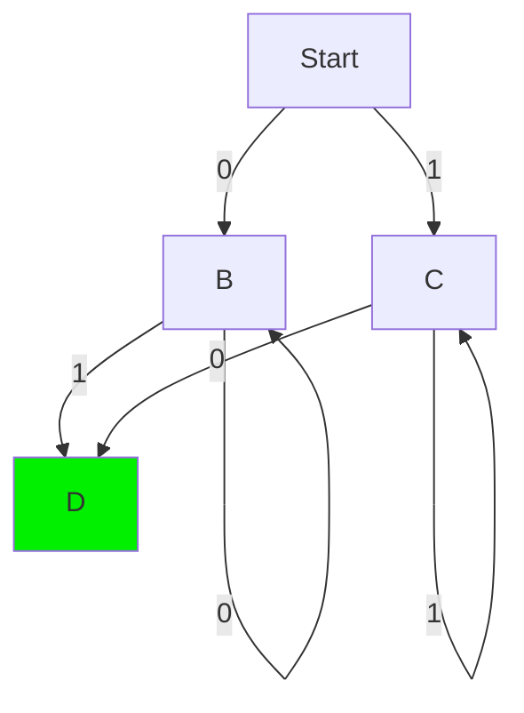
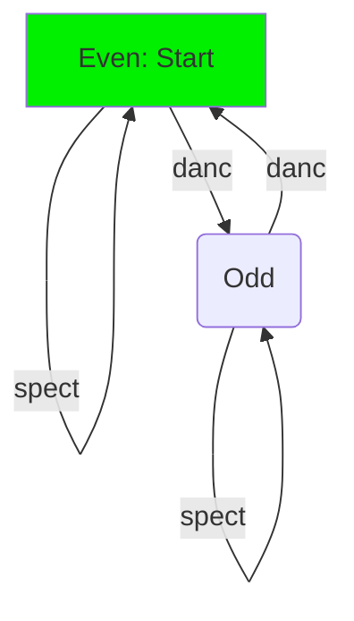

Tags: #CS-4510🧮
Date Created: Tuesday Jan 24th, 2023
Time Created: 01:53

---
# Resources

---
# Model
A math object used for computation.

# DFA: Deterministic Finite Automata
A state machine with three properties:
1. **Deterministic**: Non-random results/transitions. No optional or choice components.
2. **Finite**: Non-infinite structure. Finite number of states & transitions.
3. **Automata**: Model

## Components of a DFA
Five core components to define a DFA:
1. $Q$ : The finite set of states
2. $\Sigma$ : The "alphabet"; set of input options (must be handled by each state)
3. $q_0$ : The start state. $q_o \in Q$
4. $F$ : Subset of final/acceptable states. $F \leq Q$ 
5. $\delta$ : Transformation function $Q \times \Sigma \Rightarrow Q$. Defines transform for any $\Sigma_n$ (aka: doesn't "leave the model stranded"). 

All five of these components are **required** to define a valid DFA.

## Language
The set of strings that a DFA returns as acceptable. Determining if a given string is contained in a language can range from easy to difficult or impossible.

**Easy:** Is $0010$  in $L = \{\text{All binary strings ending in 10}\}$?
**Hard:** Is the string $s$ in the language $L = \{\text{All valid python programs for sorting data}\}$

The language of a DFA $D$ is $L(D)$, where all acceptable inputs to $D$ are in the language $L(D)$.

For example for $D$ (the DFA below), $L(D)$ is the set of all binary strings (with a length $\geq 2$) with at least one $1$ and one $0$.

### Language Inverse Theorem.
If $L$ is regular, then $\bar{L}$ is also regular.

**Prove:** For $D_a$ where $L(D_a)=L$ then create a new DFA: $D_b$ where $F_b = Q - F_a$ (inverse final states). Thus all inputs that didn't arrive at a final state in $D_a$ will arrive at a final state in $D_b$ and $L(D_b) = \bar{L}$.

### Regular Langauges
A language $L$ is regular if there is some DFA where $L(D) = L$.

Proving $L$ is regular can be easy if it is representable by a DFA (just draw it).

Proving $L$ **is NOT** regular can be more difficult. For example is the set of all binary strings with more $1$s than $0$s a regular language? (No, but I only know bc the professor said so. #todo come back to this)

## DFA Use Case Example
**Problem:** Define a program that can track if there is an even number of dancers at a ball. Calls $\text{green()}$ if even, otherwise $\text{red()}$.

### Naive counter approach
Just define some variable $x$ that increments when each dancer enters the ball. If $x\mod 2 == 0$, then return $\text{green()}$, else $\text{red()}$.

**The problem with counters**: The memory growth of this solution will be $O(n)$ because for a larger ball a larger integer will be needed and thus a larger portion of memory will be required. For an infinitely large ball an infinite amount of memory will be needed to represent the count.

### DFA approach
**State Diagram:**

**State Table:**

| state / inputs    | dancer              | spectator           |     |
| ----------------- | ------------------- | ------------------- | --- |
| isEven: **True**  | isEven => **False** | isEven => **True**  |     |
| isEven: **False** | isEven => **True**  | isEven => **False** |     |

**Why this is better:** The DFA approach uses a finite amount of memory. It is essentially the same as flipping a boolean variable repeatedly. This can be done for an infinitely large ball while still using a finite amount of memory to represent the DFA model in code.

